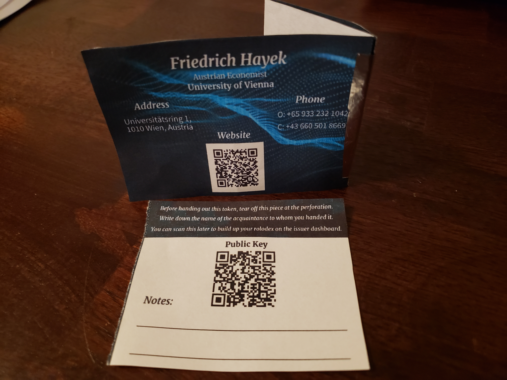

# Ethereum Crypto Business Card

### IC3 2021 Summer Camp Hackathon Project

## Overview

Generate and issue a number of paper wallet business cards to hand out to potenital clients at networking events or meetings. The paper wallet has a front facing business card displaying your personal and business details including a QR code for your website. The inner fold contains a secure ethereum private key that is hidden when folded. The last tab is for the issuer to take notes and have the public key of the indivivual who recieved the paper wallet so a tip may be sent to the address. The idea is that the tip may be redeemed by the recipient for a one hour meeting with the issuer.

## Ethereum Bulk Wallet Generator

https://flexfinrtp.github.io/ethwallet-gen-stripped/#/

## Paper Wallet

